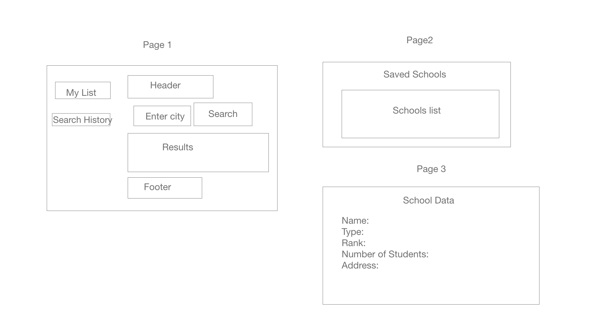

# School Explorer
## Mission Statement:
1.  Provide a platform for parents to look for top schools and save list locally for a selected area.

## Wireframe

## Apllication Instructions:

 1. User will be able to search for school data for a given location.
 2. User can add schools to his/her list.
 3. User can click on school to see additional information about that school

 # Stateless components
 1.   Search bar
 2.   Search History
 3.   Header
 4.   Footer
 5.   Navbar
 6.   School Data

 # Stateful components
 1.   SchoolsList 
 3.   App.js
 # API link
 1. https://developer.schooldigger.com/

