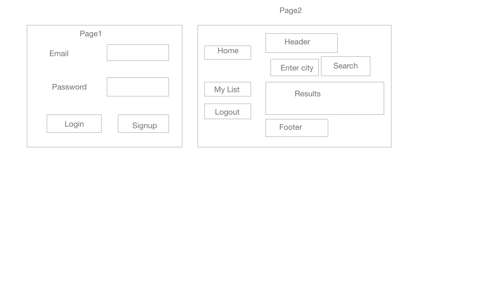

# SchoolDigger
## Mission Statement:
1.  Provide a platform for parents to look for top schools and save data locally for a selected area.
2. Audience for my projects are parents moving into Texas.
## Wireframe

## Apllication Instructions:

 1. User will enter authentication details, then server will return authentication token.
 2. Once authenticated,user will be able to search for school data for a given location.

 # Stateless components
 1.   Search bar
 3.   Header
 4.   Footer
 5.   Navbar
 6.   School Data

 # Stateful components
 1.   Schools 
 3.   App.js
 # API link
 1. https://developer.schooldigger.com/

