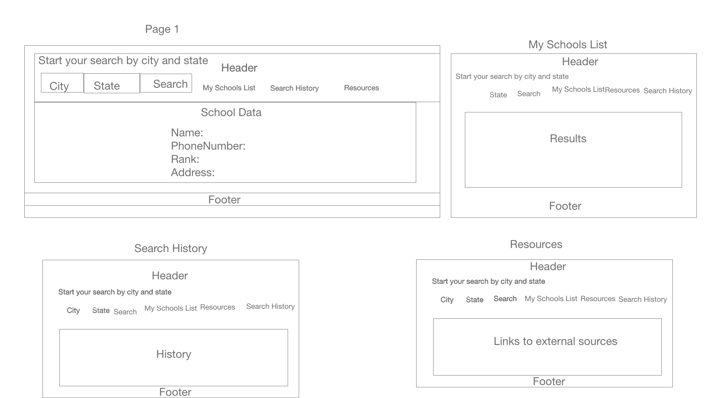

# School Explorer
## Mission Statement:
1.  Provide a platform for parents to look for top schools and save list locally for a selected city and state.
2.  audience for my project are anyone who wants to search for schools for a city/state and select few schools from the list and save schools to his/her schools list for a future reference.

## Wireframe

## Apllication Instructions:

 1. User will be able to search for school data for a given location.
 2. User can add schools to his/her list.
 3. User can browse through previous search results and search options

 # Stateless components
 1.   BrowserHistory
 2.   School Data
 3.   Header
 4.   Footer
 6.   QuickLinks

 # Stateful components
 1.   SchoolsList 
 2.   Home
 3.   App.js
 # API link
 1. https://developer.schooldigger.com/

 #  Resources
1.  https://www.youtube.com/watch?v=-MlNBTSg_Ww

